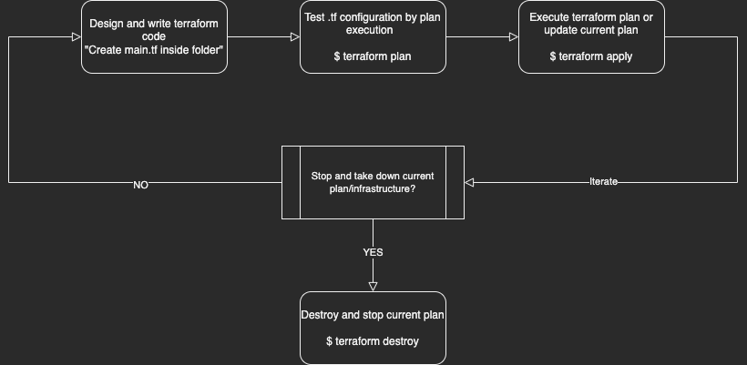

<center><h1>terraform.tf</center>


## Table of Contents

- [Table of Contents](#table-of-contents)
- [<center><a name="about" ></a>About Terraform CLI (Command Line Interface)](#centerabout-terraform-cli-command-line-interface)
  - [<a name="workflow" ></a>Basic Terraform IaC Workflow](#basic-terraform-iac-workflow)
- [<center><a name="installation" ></a>Installation](#centerinstallation)
    - [<a name="windows-install" ></a>Chocolatey on Windows](#chocolatey-on-windows)
    - [<a name="macos-install" ></a>Homebrew on macOS X (X64/arm64)](#homebrew-on-macos-x-x64arm64)
    - [<a name="linux-install" ></a>Linux - Ubuntu/Debian](#linux---ubuntudebian)
- [<center><a name="usage-commands" ></a>Usage & Commands](#centerusage--commands)
    - [<a name="terraform-help" ></a>terraform help](#terraform-help)
    - [<a name="terraform-init" ></a>terraform init](#terraform-init)
    - [<a name="terraform-plan" ></a>terraform plan](#terraform-plan)
    - [<a name="terraform-apply" ></a>terraform apply](#terraform-apply)
    - [<a name="terraform-destroy" ></a>terraform destroy](#terraform-destroy)
    - [<a name="terraform-show" ></a>terraform show](#terraform-show)
    - [<a name="terraform-providers" ></a>terraform providers](#terraform-providers)
    - [<a name="terraform-workspace" ></a>terraform workspace](#terraform-workspace)
- [<center><a name="integrations" ></a>Integrations](#centerintegrations)
    - [<a name="signalfx" ></a>signalfx](#signalfx)


## <center><a name="about" ></a>About Terraform CLI (Command Line Interface)

<li>Terraform, a tool created by Hashicorp in 2014, written in Go (Golang), aimed to build, change and version control your infrastructure.

<li>This concept adapted the process of Infrastructure as Code (IaC), a process of managing and provisioning computer data through machine-readable files which can be version controlled and reused.

<li>This tool has a powerfull and very intuitive Command Line Interface. Leveraging 4-5 commands like GitHub to initiliaze, plan, apply, show, and destroy</li>
<center>

### <a name="workflow" ></a>Basic Terraform IaC Workflow


</center>

## <center><a name="installation" ></a>Installation


#### <a name="windows-install" ></a>Chocolatey on Windows

* <a href="https://chocolatey.org">Chocolatey</a> is a free and open-source package management system for Windows. Install the Terraform package from the command-line.


```
$ choco install terraform
``` 

* Verify the installation using the --version flag or version command	

```
$ terraform version
Terraform vX.X.X
on OS_Architecture
``` 

#### <a name="macos-install" ></a>Homebrew on macOS X (X64/arm64)


* <a href="https://brew.sh">Homebrew</a> is a free and open-source package management system for macOS. Install the Terraform package from the command-line.

```
$ brew install terraform 
``` 

* Verify the installation using the --version flag or version command	

```
$ terraform version
Terraform vX.X.X
on OS_Architecture
``` 

#### <a name="linux-install" ></a>Linux - Ubuntu/Debian


* First, we will apply updates to our system to update any dependency needed for terraform, also doing you a favor :) 

```
$ sudo apt update
``` 

* Second, perform a apt-get to install terraform

```
$ sudo apt-get install terraform
``` 

* Third, verify installation via terraform version

```
$ terraform version
Terraform vX.X.X
on OS_Architecture
``` 
## <center><a name="usage-commands" ></a>Usage & Commands


#### <a name="terraform-help" ></a>terraform help

* View all commands using terraform --help


```
$ terraform --help
Usage: terraform [global options] <subcommand> [args]

The available commands for execution are listed below.
The primary workflow commands are given first, followed by
less common or more advanced commands.

Main commands:
  init          Prepare your working directory for other commands
  validate      Check whether the configuration is valid
  plan          Show changes required by the current configuration
  apply         Create or update infrastructure
  destroy       Destroy previously-created infrastructure

All other commands:
  console       Try Terraform expressions at an interactive command prompt
  fmt           Reformat your configuration in the standard style
  force-unlock  Release a stuck lock on the current workspace
  get           Install or upgrade remote Terraform modules
  graph         Generate a Graphviz graph of the steps in an operation
  import        Associate existing infrastructure with a Terraform resource
  login         Obtain and save credentials for a remote host
  logout        Remove locally-stored credentials for a remote host
  output        Show output values from your root module
  providers     Show the providers required for this configuration
  refresh       Update the state to match remote systems
  show          Show the current state or a saved plan
  state         Advanced state management
  taint         Mark a resource instance as not fully functional
  test          Experimental support for module integration testing
  untaint       Remove the 'tainted' state from a resource instance
  version       Show the current Terraform version
  workspace     Workspace management

Global options (use these before the subcommand, if any):
  -chdir=DIR    Switch to a different working directory before executing the
                given subcommand.
  -help         Show this help output, or the help for a specified subcommand.
  -version      An alias for the "version" subcommand.


```

#### <a name="terraform-init" ></a>terraform init


* This command is requiredto be executed to initialize the terraform file in the current directory


* No other command will work as this command installs:
	* Terraform modules
	* Backend files 
	* Provider(s) plugins


```
$ terraform init

Initializing the backend...

Initializing provider plugins...

Partner and community providers are signed by their developers.
If you'd like to know more about provider signing, you can read about it here:
https://www.terraform.io/docs/cli/plugins/signing.html

Terraform has created a lock file .terraform.lock.hcl to record the provider
selections it made above. Include this file in your version control repository
so that Terraform can guarantee to make the same selections by default when
you run "terraform init" in the future.

Terraform has been successfully initialized!

``` 


<h4>terraform validate</h4>

* This command is used to validate/check the syntax of the Terraform files. A syntax check is done on all terraform files in the directory.


```
$ terraform validate

Success! The configuration is valid.

``` 


#### <a name="terraform-plan" ></a>terraform plan


* This command is not required but heavily recommended to see a plan of what will get executed as a test before applying to "PROD"

```
$ terraform plan

Terraform used the selected providers to generate the following execution plan. Resource actions are indicated with the following symbols:
  + create

Terraform will perform the following actions:

*List of infrastrure chages*


Plan: 30 to add, 0 to change, 0 to destroy.
``` 

* It is recommended but optional to export your plan using the -out flag to make sure the plan is executed without any change. 

```
$ terraform plan -out file.out

Saved the plan to: file.out

To perform exactly these actions, run the following command to apply:
    terraform apply "file.out
``` 


#### <a name="terraform-apply" ></a>terraform apply


* This command is the final command to execute the plan and build out all terraform modules to build the infrastructure.


```
$ terraform apply


``` 

* You can target a specific module to apply using the -target flag

```
$ terraform apply -target=file.tf

```

* You can auto approve the confirmation prompt with the -auto-approve flag

```
$ terraform apply -auto-approve

```

#### <a name="terraform-destroy" ></a>terraform destroy


* This command is used to stop and destroy current plan execution


```
$ terraform destroy

Terraform used the selected providers to generate the following execution plan. Resource actions are indicated with the following symbols:
  - destroy

Terraform will perform the following actions:

Do you really want to destroy all resources?
  Terraform will destroy all your managed infrastructure, as shown above.
  There is no undo. Only 'yes' will be accepted to confirm.

  Enter a value: (Type yes or no)
  
  
  
  
  Destroy complete! Resources: XX destroyed.

``` 

#### <a name="terraform-show" ></a>terraform show


* This command is used to show current configuration running


```
$ terraform show

*Shows current configuration running*
``` 


#### <a name="terraform-providers" ></a>terraform providers


* This command shows you the list of providers required in current configuration


```
$ terraform providers

Providers required by configuration:
.
└── provider[registry.terraform.io/hashicorp/XXXXXXX]

``` 

#### <a name="terraform-workspace" ></a>terraform workspace
<h4>terraform workspace</h4>

* This command allows infrastructure environmnet management by using the workspace command
	* Makes it easier than having to create new copies of the directories

* create workspace using workspace new <name>


```
$ terraform workspace new dev

Created and switched to workspace "dev"!

You're now on a new, empty workspace. Workspaces isolate their state,
so if you run "terraform plan" Terraform will not see any existing state
for this configuration.

``` 

* List all workspaces using workspace list


```
$ terraform workspace list
  default
* dev


``` 


* Select workspace/environment after running previous command


```
$ terraform workspace select default
Switched to workspace "default".


``` 


## <center><a name="integrations" ></a>Integrations

#### <a name="signalfx" ></a>[signalfx](integrations/signalfx.md)